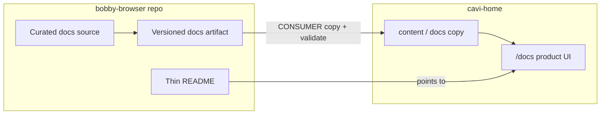

# OSS Publish Prep Docs Package - Plan

## Goal Capsule

- **Objective:** Prepare bobby-browser for a later public OSS flip with a dual-audience docs package: a thin public README/quick start, and a cavi-home-ingestible versioned Markdown docs artifact — without flipping repository visibility in this work.
- **Product authority:** Product Contract below (session-settled decisions preserved). Plan HOW authority: Planning Contract KTDs.
- **Product Contract preservation:** Product Contract unchanged (R/A/F/AE IDs preserved). Outstanding Questions resolved into KTDs; deferred npm-tarball line closed by KTD-3.
- **Execution profile:** Docs/content + small Node integrity tooling; no runtime behavior change.
- **Stop conditions:** Do not flip GitHub visibility; do not implement cavi-home host routes in this repo; do not port all `docs/superpowers/specs` into the public corpus.
- **Open blockers:** None.

## Product Contract

### Summary

Ship an OSS **prep package** in this repo: curated public tree (full runtime source + legal/security + CONTRIBUTING + thin README), strip agent/internal-only material from what will ship, and add a versioned docs artifact with `navigation.json` / `manifest.json` that cavi-home can ingest the same way it ingests api-client docs. Do **not** change GitHub visibility here.

### Problem Frame

The repo already has a long technical README, MIT LICENSE, SECURITY.md, design specs under `docs/superpowers/`, and prior OSS scrub/CI work — but no CONTRIBUTING, no wiki-ingest layout, and no allowlisted public docs package. Deep technical detail is hard to land on as a first-time OSS reader and is not shaped for the landing-page docs host. Private/agent process files and uncurated internal docs risk leaking into a future public tree.

### Key Decisions

- **Prep only; human flips visibility later.** This effort never toggles the repository to public. `(session-settled: user-directed — chosen over "ship public as part of this work": user will flip visibility themselves.)`
- **One coherent prep package.** Public/private split + wiki-ready technical docs + clean README land together; not README-only or wiki-only. `(session-settled: user-directed — chosen over staged wiki-first or README-first: one publish-ready package.)`
- **Dual audience, equal weight.** README is the GitHub front door; the versioned docs corpus is the full technical surface for the landing-page docs UI. Neither is "good enough alone." `(session-settled: user-directed — chosen over optimizing only OSS newcomers or only wiki readers.)`
- **Follow the api-client → cavi-home docs contract.** Curated Markdown + navigation, built into an immutable versioned directory with `manifest.json` and `navigation.json`, documented by a CONSUMER contract for the host. `(session-settled: user-directed — chosen over inventing a new ingest format: user pointed at cavi-api-client and cavi-home.)`
- **Curated allowlist for what ships publicly.** Versioned docs artifact, thin README, LICENSE/SECURITY/CONTRIBUTING, and intentionally public source; everything else stays private or unpublished. `(session-settled: user-directed — chosen over agent-local-only denylist or process-docs-only denylist.)`
- **Full runtime source is public OSS.** Crates/packages/schemas that make the product work ship; allowlisting mainly gates docs and strips agent/internal files. `(session-settled: user-directed — chosen over shipping a code subset or deferring the source allowlist.)`

### Actors

- A1. **External OSS developer** — lands on README, needs orientation + quick start, links into deeper docs.
- A2. **Landing-page docs reader** — browses the versioned corpus in cavi-home's custom `/docs/<product>` UI.
- A3. **Maintainer / publisher** — builds or copies the immutable docs artifact and validates it for host ingest; later flips repo visibility outside this work.
- A4. **cavi-home docs host** — consumes the versioned artifact via the CONSUMER contract (copy/validate; do not edit generated pages in place).

### Key Flows

- F1. OSS landing
  - **Trigger:** A1 opens the GitHub README.
  - **Actors:** A1
  - **Steps:** Read what the project is; run quick start; follow link to online docs for depth.
  - **Outcome:** Runnable first success without reading the full technical corpus.
  - **Covered by:** R1, R2, R8

- F2. Docs artifact build and host ingest
  - **Trigger:** A3 publishes or updates docs for a documented version.
  - **Actors:** A3, A4
  - **Steps:** Curate source pages + navigation; produce immutable versioned directory with manifest + navigation; validate integrity; host copies the complete version directory and serves under the public base path / stable alias.
  - **Outcome:** Landing-page docs UI shows a navigable, version-pinned corpus.
  - **Covered by:** R3, R4, R5, R6, R7

- F3. Private material stays out
  - **Trigger:** Prep package is reviewed before a future public flip.
  - **Actors:** A3
  - **Steps:** Check allowlist; confirm agent homes, execution plans, and other non-allowlisted material are absent from the public-ready tree.
  - **Outcome:** No private/process-only files in what will be public.
  - **Covered by:** R9, R10



### Requirements

**README / GitHub front door**

- R1. The public README states what bobby-browser is, alpha status, and primary control surfaces in a short orientation — not a dump of the full technical corpus.
- R2. The README includes a working quick start path to a first successful local run and a clear link to the online docs for depth.
- R8. Deep reference material that today lives primarily in the long README moves into the versioned docs corpus; the README stays the front door.

**Versioned docs artifact (cavi-home ingest)**

- R3. Technical docs are authored as Markdown pages with an explicit navigation entry point suitable for the existing cavi-home docs shell pattern.
- R4. Each published docs set is an **immutable versioned directory** containing at least `manifest.json`, `navigation.json`, and the page tree; hosts replace the whole version directory rather than editing pages in place.
- R5. A CONSUMER contract document describes copy path, public base path / stable alias, required entrypoints, and integrity checks the host must fail on mismatch.
- R6. Navigation paths are relative to the public base path and match files present in the artifact.
- R7. The first corpus covers orientation, concepts needed to use the runtime safely, quick start-equivalent depth, and the main public control surfaces — enough that A2 is not forced back into design-spec archaeology for normal use.

**Public tree / private material**

- R9. The public-ready tree includes full product source (crates/packages/schemas needed to run and build), LICENSE, SECURITY.md, CONTRIBUTING, thin README, and the versioned docs artifact (plus CONSUMER contract).
- R10. Agent-local homes, execution-plan scratch, and other non-allowlisted internal process material do not ship in the public-ready tree.
- R11. This work does **not** change GitHub repository visibility from private to public.

**Contributor / security posture (prep)**

- R12. CONTRIBUTING exists and points newcomers at how to build, test, and contribute at a level consistent with alpha OSS.
- R13. SECURITY.md remains the security reporting path; public docs must not instruct insecure default exposure (loopback / operator-controlled boundary guidance stays intact).

### Acceptance Examples

- AE1. **Covers R1, R2, R8.** Given a cold OSS reader opens README only, when they follow quick start, then they can run a health check / minimal serve path without reading design specs; deeper topics are linked out to online docs.
- AE2. **Covers R4, R5, R6.** Given a built versioned docs directory, when a host validates `manifest.json` and loads `navigation.json`, then every listed page path resolves and integrity failure rejects ingest.
- AE3. **Covers R9, R10, R11.** Given the prep package is complete, when maintainers review the public-ready tree, then allowlisted public artifacts are present, agent/process-only paths are absent, and repository visibility is unchanged.

### Success Criteria

- A1 can answer "what is this?" and complete quick start from README alone.
- A2 can navigate the landing-page docs corpus without opening `docs/superpowers/specs` for ordinary usage topics.
- A3 can hand a validated versioned directory to cavi-home using the CONSUMER contract.
- A future public flip is a visibility change plus final scrub check — not inventing the docs system at flip time.

### Scope Boundaries

**In scope**

- Thin README rewrite / demotion of deep README content into the docs corpus
- Curated docs source + versioned artifact + CONSUMER contract aligned with api-client → cavi-home
- Public-tree allowlist hygiene (ignore rules, untrack/remove non-allowlisted process files as needed)
- CONTRIBUTING for alpha OSS
- Prep verification checklist for a later human-driven public flip

**Deferred for later**

- Actually flipping the GitHub repository to public
- Full cavi-home product route/UI work beyond what the CONSUMER contract requires of this repo (host may need a parallel change to add `/docs/bobby-browser` or equivalent)
- Exhaustive port of every historical design spec into the public corpus
- api-client-style contract codegen / tarball-bound docs render pipeline (v1 is curated Markdown → immutable copy)

**Outside this effort's identity**

- Redesigning the runtime product surface
- Building a third-party docs platform (Docusaurus/Mintlify/etc.) instead of cavi-home

### Dependencies / Assumptions

- Assumption: cavi-home's api-client docs shell (navigation + Markdown pages + version selector patterns) is the target consumer; bobby-browser docs should be shape-compatible even if host wiring is a separate PR.
- Assumption: Existing MIT LICENSE and SECURITY.md remain authoritative; this work does not re-license.
- Dependency: Prior OSS scrub/CI public-only patterns already in history; this work builds on them rather than inventing visibility policy.
- Verified: no CONTRIBUTING/wiki-ingest layout in this repo; README already has Rust/TS quick starts but is long; `.gitignore` already excludes agent homes and `docs/superpowers/plans/` (at least one plan file may still be tracked).

### Outstanding Questions

None blocking. Plan-time forks resolved in Planning Contract KTDs.

### Sources / Research

- `cavi-ai/cavi-api-client`: `docs/api-client/source/` + `navigation.json`, build → `docs/api-client/vX.Y.Z/`, `docs/api-client/CONSUMER.md`
- `cavi-ai/cavi-home`: `content/api-client/v*/` + `app/docs/api-client/` custom layout
- This repo: `README.md`, `SECURITY.md`, `LICENSE`, `.gitignore`, `docs/superpowers/specs/`, `.github/workflows/ci.yml` public-only guard, `feat/oss-alpha` history

---

## Planning Contract

### Key Technical Decisions

- **KTD-1. Product slug and paths.** Use `bobby-browser` as the docs product id. Source lives under `docs/bobby-browser/source/`. Immutable artifact at `docs/bobby-browser/v0.2.0/`. CONSUMER declares `publicBasePath: /docs/bobby-browser/v0.2.0` and `stableAlias: /docs/bobby-browser`. `(session-settled: user-approved — chosen over inventing a different slug: confirmed plan-time default.)`
- **KTD-2. Docs version = Cargo workspace version.** Pin the first artifact to workspace `0.2.0` from `Cargo.toml` `[workspace.package].version`. `(session-settled: user-approved)`
- **KTD-3. Integrity without npm tarball.** Manifest includes `package`/`product` identity (`bobby-browser`), `version`, optional `release.commit` / `release.tag` when known, and required `contentSha256` over every artifact file except `manifest.json` (lexical path order, `path` + NUL + bytes + NUL — same hashing shape as api-client CONSUMER). Omit `sourceTarballSha256` in v1. `(session-settled: user-approved — chosen over requiring an npm tarball authority.)`
- **KTD-4. Build shape for v1.** Curated Markdown pages + `navigation.json` in source; a small build/copy script materializes the versioned directory (pages + navigation + computed manifest). No api-client contract-codegen / tarball inspect pipeline in this prep. `(session-settled: user-approved)`
- **KTD-5. Agent instruction clones out of public-ready tree.** Remove from git tracking (and ignore going forward): `AGENTS.md`, `CLAUDE.md`, `GEMINI.md`, `QODER.md`, and any still-tracked `docs/superpowers/plans/*`. Keep product code and public docs. `(session-settled: user-approved)`
- **KTD-6. Design specs excluded from public docs corpus.** Do not publish `docs/superpowers/specs` into the versioned artifact or treat them as the public wiki corpus. Prefer removing them from the public-ready allowlist (untrack or relocate under an ignored private path). Historical design content may inform curated pages but is rewritten for public readers. `(session-settled: user-approved)`
- **KTD-7. Host wiring out of this repo.** This plan ships a CONSUMER-ready artifact only. Adding `/docs/bobby-browser` to `cavi-ai/cavi-home` is a separate follow-up. `(session-settled: user-approved)`
- **KTD-8. Online docs URL in README.** README links to `https://cavi-ai.xyz/docs/bobby-browser` (stable alias). Until the host ships the route, the link may 404 — CONSUMER + checklist note that host wiring is a prerequisite for a live link, not for completing this repo prep.

### High-Level Technical Design

```text
docs/bobby-browser/
  source/
    navigation.json
    pages/
      introduction/{overview,installation,quickstart}.md
      concepts/{...}.md
      surfaces/{rust-sdk,typescript-sdk,mcp-stdio,mcp-http,cdp}.md
      guides/{auth,javascript-eval,intents,events-recovery,configuration,run}.md
      security/{model,reporting}.md
      release/{changelog-stub,license}.md
  CONSUMER.md
  v0.2.0/          # build output (immutable)
    manifest.json
    navigation.json
    <pages...>
scripts/docs/
  build-bobby-browser.mjs   # source → v0.2.0 + contentSha256
  verify-bobby-browser.mjs  # nav resolve + hash check
```

Page content is lifted/rewritten from the current long `README.md` sections (auth, multi-principal, JS eval, intents, quick starts, MCP, CDP, events/recovery, config, run, security pointers). Quality-gate and release-certification detail stays contributor-facing in CONTRIBUTING / existing scripts — not dumped into the landing README.

### Assumptions

- cavi-home can host a second product docs tree with the same navigation.json + Markdown conventions as api-client; only the product slug and content differ.
- Workspace Cargo version remains the docs version pin until a deliberate docs versioning policy changes.
- Removing agent instruction files does not block local agent use (those tools regenerate or use user-level config).

### Implementation Constraints

- Repo-relative paths only in docs and scripts.
- Do not put bearer tokens, private absolute paths, or machine-local cwd into committed docs (prior `.mcp.json` scrub pattern).
- Preserve SECURITY.md private-reporting guidance; never instruct exposing the runtime on untrusted networks as a default.
- Do not change `github.event.repository.private` CI policy as a substitute for visibility flip.

### Sequencing

1. U1 curated source + navigation (content foundation)
2. U2 build + CONSUMER + verify scripts/tests
3. U3 thin README + CONTRIBUTING (depends on stable online docs path from KTD-1/KTD-8)
4. U4 allowlist hygiene + prep checklist (can parallelize with U3 after U2 proves artifact shape)

### Risks & Dependencies

- **Host lag:** README online-docs link may 404 until cavi-home adds the product. Mitigation: CONSUMER + checklist make host wiring explicit; artifact remains valid offline.
- **Content drift:** Thin README vs docs corpus can diverge. Mitigation: source of truth is `docs/bobby-browser/source`; README only summarizes and links.
- **Over-deletion:** Removing `docs/superpowers/specs` from git loses history in-tree. Mitigation: git history retains them; optional private archive outside allowlist is fine.

## Implementation Units

### U1. Curated docs source and navigation IA

- **Goal:** Author the first public docs corpus as Markdown pages + `navigation.json` under `docs/bobby-browser/source/`.
- **Requirements:** R3, R7, R8, R13
- **Files:** `docs/bobby-browser/source/navigation.json`, `docs/bobby-browser/source/pages/**/*.md`, (read) `README.md`, `SECURITY.md`
- **Approach:** Create introduction / concepts / surfaces / guides / security / release sections. Rewrite README depth into pages; keep security posture (loopback / operator boundary, private vuln reporting). Navigation paths relative, matching api-client section/page shape.
- **Dependencies:** None
- **Test scenarios:**
  - Every `navigation.json` page path resolves to an existing file under `pages/`
  - Introduction includes overview + installation/quickstart depth sufficient for AE1-equivalent online reading
  - No page instructs default exposure on untrusted networks
- **Verification:** Manual nav walk + `scripts/docs/verify-bobby-browser.mjs` once U2 lands (re-run)

### U2. Versioned artifact build, CONSUMER, integrity verification

- **Goal:** Materialize immutable `docs/bobby-browser/v0.2.0/` with `manifest.json`, `navigation.json`, pages, plus CONSUMER contract and verify tooling.
- **Requirements:** R4, R5, R6
- **Files:** `scripts/docs/build-bobby-browser.mjs`, `scripts/docs/verify-bobby-browser.mjs`, `scripts/docs/bobby-browser-docs.test.mjs`, `docs/bobby-browser/CONSUMER.md`, `docs/bobby-browser/v0.2.0/**`, optional `package.json` script entries (`docs:build`, `docs:verify`, `docs:test`)
- **Approach:** Build copies source pages + navigation into `v0.2.0`, writes manifest (`product`/`package`: `bobby-browser`, `version`: `0.2.0`, `contentSha256`, optional release metadata). CONSUMER mirrors api-client structure adapted for content-hash-only authority. Verify fails on missing nav targets or hash mismatch. Unit tests in `bobby-browser-docs.test.mjs` cover hash stability, tamper detection, and broken-nav failure (Node built-in test runner).
- **Dependencies:** U1
- **Test scenarios:**
  - Fresh build produces identical `contentSha256` for unchanged source (deterministic)
  - Tampering a page file makes verify fail
  - Broken nav path makes verify fail
  - CONSUMER documents entrypoints, base path, alias, and fail-closed integrity
- **Verification:** `node scripts/docs/build-bobby-browser.mjs` && `node scripts/docs/verify-bobby-browser.mjs` && `node --test scripts/docs/bobby-browser-docs.test.mjs`

### U3. Thin README and CONTRIBUTING

- **Goal:** Replace the long README with a front-door orientation + quick start + online docs link; add CONTRIBUTING for alpha OSS.
- **Requirements:** R1, R2, R8, R12, R13
- **Files:** `README.md`, `CONTRIBUTING.md`
- **Approach:** README: what it is, alpha banner, surfaces list, Rust/TS quick start (keep working commands from current README Run/quick start), link to `https://cavi-ai.xyz/docs/bobby-browser`, pointer to SECURITY.md and CONTRIBUTING. Move deep sections out (already in U1). CONTRIBUTING: build (`cargo test --workspace` as primary gate), how to propose changes, alpha expectations, link to docs build/verify scripts.
- **Dependencies:** U1 (for accurate deep-link targets); U2 preferred so online path + CONSUMER exist
- **Test scenarios:**
  - README quick start commands match current Run/healthz guidance
  - README does not retain full former technical dump
  - CONTRIBUTING names concrete test commands from existing Quality gates
- **Verification:** Human read-through against AE1; `rg`-level check that deep former README headings are absent or reduced to links

### U4. Public-tree allowlist hygiene and prep checklist

- **Goal:** Align the git tree with the public allowlist: strip agent/process material, keep specs out of the public docs story, document the pre-flip checklist — without flipping visibility.
- **Requirements:** R9, R10, R11
- **Files:** `.gitignore`, `docs/OSS_PUBLISH_CHECKLIST.md` (or equivalent under `docs/bobby-browser/`), git index changes for `AGENTS.md` / `CLAUDE.md` / `GEMINI.md` / `QODER.md` / `docs/superpowers/plans/*` / `docs/superpowers/specs/**` per KTD-5/KTD-6
- **Approach:** Untrack listed process files; ensure ignore rules cover agent homes and plans; relocate or untrack specs per KTD-6; add a short checklist: secrets scrub, allowlist review, docs build+verify, CONSUMER handoff to cavi-home, then human visibility flip (explicitly out of automated scope).
- **Dependencies:** U2 (artifact must exist to list on checklist)
- **Test scenarios:**
  - `git ls-files` no longer lists agent instruction clones or `docs/superpowers/plans/*`
  - Specs are not part of `docs/bobby-browser/v0.2.0/`
  - Checklist states visibility flip is manual / out of scope for this prep
- **Verification:** `git ls-files` allowlist spot-check; docs verify still passes; no GitHub visibility API/CLI calls in the change set

## Verification Contract

| Gate | Command / check | Applies |
|---|---|---|
| Docs build | `node scripts/docs/build-bobby-browser.mjs` (or package.json script alias) | After U1–U2 |
| Docs verify | `node scripts/docs/verify-bobby-browser.mjs` | After every docs change |
| Docs unit tests | `node --test scripts/docs/bobby-browser-docs.test.mjs` | After U2 |
| Workspace tests | `cargo test --workspace` | Before claiming prep complete (ensure hygiene did not break build) |
| Visibility | Confirm no `gh repo edit --visibility` (or equivalent) in the work | Always (R11) |
| Allowlist | `git ls-files` spot-check against KTD-5/KTD-6 denylist | U4 |
| README cold-read | AE1 manual: orientation + quick start without specs | U3 |

Live Chromium/Firefox ignored proofs are **not** required to complete this docs prep unless a hygiene change touches runtime crates.

## Definition of Done

**Global**

- [ ] `docs/bobby-browser/source/` + `v0.2.0/` + `CONSUMER.md` exist and verify clean
- [ ] README is thin front door with working quick start and online docs link
- [ ] CONTRIBUTING exists with concrete build/test pointers
- [ ] Agent instruction clones and superpowers plans are untracked; specs excluded from public docs corpus
- [ ] Prep checklist documents manual visibility flip
- [ ] Repository visibility unchanged
- [ ] Abandoned experimental docs paths/scripts removed from the diff

**Per unit**

- U1: Nav resolves; first-corpus topics present; security posture preserved
- U2: Build deterministic; verify catches tamper and broken nav; CONSUMER complete
- U3: AE1 satisfied; deep README content demoted
- U4: AE3 satisfied; checklist present; no visibility flip
